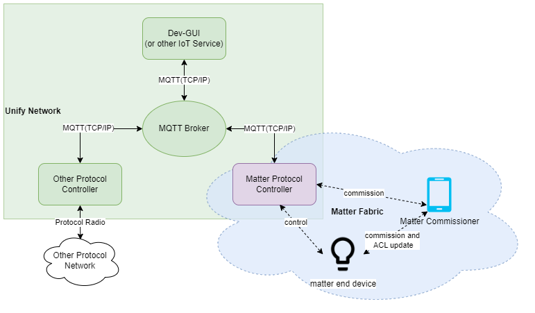

# Unify Matter Protocol Controller Overview

The Unify Matter Protocol Controller(UMPC) is an application that makes Matter capable devices on a Matter fabric accessible on a Unify network. It does so by acting
as a _Protocol Controller_ in a Unify Framework.

In the Unify Framework, _protocol controllers_ translate raw wireless
application protocols such as Z-Wave and Zigbee into a common API called the
Unify Controller Language (UCL). This enables IoT services to operate and
monitor Z-Wave and Zigbee networks without being aware of the underlying
wireless protocol.

In Unify, the transport between IoT services and Protocol Controllers is MQTT
using JSON payloads for data representation.

On the Matter fabric, the Unify Matter Protocol Controller is a Matter controller that is able to control/operate on the Matter end devices. 

The figure below illustrates the system architecture of the Unify Matter PC
in both Unify and Matter system.

More Information about the Unify Framework can be found
[here](https://siliconlabs.github.io/UnifySDK/doc/UnifySDK.html)

## Trying Out the Unify Matter PC

To test the Unify Matter PC, a Raspberry Pi 4 is recommended. Install the
latest release of the Unify SDK following the
[Unify Host SDK Getting Started Guide](https://siliconlabs.github.io/UnifySDK/doc/getting_started.html).
Once the base Unify system is up and running, the Unify Matter PC may be
installed on the Raspberry Pi 4.

The
[Silicon Labs Matter GitHub release](https://github.com/SiliconLabs/matter/releases)
contains ready-to-use binaries of the chip-tool and package of the Unify Matter PC.

> Note that the Unify Host SDK uses Raspberry Pi OS as the base system as
> opposed to the standard Ubuntu system used for the Matter OpenThread Border
> Router image.

## Unify Matter PC as a Protocol Controller

The Unify Matter PC is a Unify Protocol Controller that allows for control of Matter
devices from a Unify framework/IoT Service. It translates Unify MQTT publish messages into the corresponding Matter cluster commands and
attribute update reports back into Unify MQTT publish messages. 

The Unify data model is largely based on the same data model as Matter, making
the job of the Unify Matter PC relatively simple. There is almost a 1-1
relationship between them.

See the [GitHub release notes](https://github.com/SiliconLabs/matter/releases)
for details on feature additions, bug fixes, and known issues.

## Unify MPC Detection and Handling of Failing Nodes

An endnode on Matter Protocol Controller is considered as failing node if any of the following scenarios are observed:
- Message transmission failure
- Failed to receive an acknowledgement
- Periodic attribute reporting failure

### Message Transmission Failure:

When a transmission to a device fails or a command fails to be sent to a node, the node is marked as failing/offline. The Matter Protocol Controller (MPC) 
updates the state of the Unified Node ID (UNID) to "Offline".  If a transmission to a device fails while it is still being interviewed (during the initial 
setup process), the node is directly marked as failing, and the state is updated to "Offline".

### Failed to Receive an Acknowledgement:

When a command fails to receive acknowledgement from a node, the node is marked as failing/offline. 

### Periodic Attribute Reporting Failure:

A device has certain attributes that need to be reported. We set up periodic reporting for these attributes, and they're sent at regular intervals. The 
longest interval between reports is MaxIntervalCeiling which can be adjusted in a configuration, it is defaulting to 60 minutes. 
These regular updates aren't just for syncing attribute data between the device and our system but it also acts as heartbeat for connection. If we haven't 
received an update within the MaxIntervalCeiling timeframe, we try to reconnect to the device to confirm  it's still available. If we can't reconnect, we mark it as failing.

## Unify MPC Recovery Of Failing/Offline Nodes:

When nodes are marked as failing or offline, they need to recover from failing or offline states to become online again. There are multiple recovery mechanisms available as explained below.

### Auto-Recovery Process

In the auto-recovery process, nodes that are less likely to recover autonomously are filtered out based on specific criteria. Nodes in non-functional or 
intervening states, which typically require manual intervention for complete recovery, are excluded from the automatic recovery process. 

#### Recovery After Boot-up
During system boot-up, we attempt to recover select failing nodes on a a first-fail, first-recover approach, ensuring that nodes with recent failures are 
addressed promptly. The auto-recovery is done by attempting to re-subscribe to failing nodes that have been marked as failing for less than 24 hours. 
Auto-recovery attempts are staggered, with a 5-second throttling interval between recovery attempts, and only 2 nodes processed in each attempt. If we 
successfully re-subscribe to a failing node, we remove its from the failing node status and revert its state to what it was before the failure occurred. 
Moreover, these criteria settings are configurable to adapt to varying network conditions and failure rates in [mpc specific configuration](./readme_user.md#mpc-specific-configuration).

### Message based Recovery

In case of message transmission failure, the failing status will be removed once a command is successfully sent to the node. Upon removal of the failing status, the state is updated to the last known state. 
Incase of acknowldegment failure, the failing status will be removed if node recevices any incoming message from the node. Upon removal of the failing status, the state is updated to the last known state.

## Supported Clusters/Devices

The Unify Matter PC currently supports mapping the following clusters/device
types.

| Cluster                      |
| ---------------------------- |
| OnOff                        |

## Next Steps

-   [Building the Matter PC](./readme_building.md)
-   [Running the Matter PC](./readme_user.md#running-the-matter-pc)
-   [Controlling a Matter OnOff device](./readme_user.md#control-an-onoff-device)

For more information about the Unify SDK see
[Unify Host SDK Documentation](https://siliconlabs.github.io/UnifySDK/doc/UnifySDK.html)
